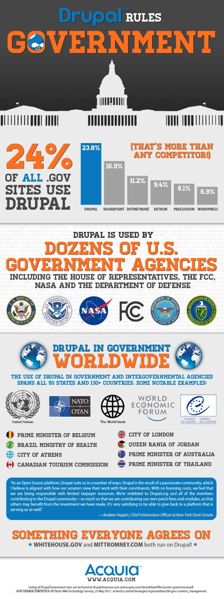

#Introducción

##¿Qué es Drupal?

Drupal es uno de los marcos de aplicación (Application-Frameworks) más utilizado a nivel mundial para la creación, publicación y mantenimiento de Sistemas de Gestión de Contenido (CMS, en inglés). Como una buena caja de herramientas le permite que prácticamente cualquier tipo de sitio web sea implementado individualmente de forma rápida y garantizando alta calidad.

Drupal es una plataforma de código abierto, que permite de forma fácil a individuos, equipos y comunidades, crear, publicar, gestionar y organizar una amplia variedad de contenido en un sitio web. Hoy en día decenas de miles de personas y organizaciones utilizan Drupal para crear diferentes sitios web, incluyendo portales comunitarios, sitios Web corporativos, sitios de redes sociales, sitios web personales o blogs, y mucho más. Drupal es un programa libre, con licencia GNU/GPL, escrito en PHP, desarrollado y mantenido por una activa comunidad mundial de usuarios. Destaca por la calidad de su código y de las páginas generadas, el respeto de los estándares de la web, y un énfasis especial en la usabilidad, seguridad, y consistencia de todo el sistema.

##¿Para que se puede ocupar Drupal?

El diseño de Drupal es especialmente idóneo para construir y gestionar comunidades en Internet. Su flexibilidad y adaptabilidad, así como la gran cantidad de módulos adicionales disponibles, hace que sea adecuado para realizar muchos tipos diferentes de sitios web.

Drupal es un gestor de contenidos multipropósito que puede usarse para aplicaciones como por ejemplo:

* Portales comunitarios
* Foros de discusión
* Sitios web corporativos
* Aplicaciones de Intranet
* Sitios personales o blogs
* Aplicaciones de comercio electrónico
* Directorio de recursos
* Sitios de redes sociales
 
 Tu imaginaición es el límite.

## ¿Quiénes ocupan Drupal?

Drupal ha sido rápidamente adoptado por su versatilidad, su código seguro y robusto por muchas universidades en el mundo, al tal punto que 71 del TOP 100 de las universidades a nivel mundial utilizan Drupal para publicar y mantener sus sitios web. Entre ellas Harvard University, Columbia University, École Normale Supérieure de París, Katholieke Universiteit Leuven, Massachusetts Institute of Technology (MIT), Princeton University, Stanford University, Swiss Federal Institute of Technology, UCLA, Berkeley, University of Cambridge y Yale University.

En nuestro país, existe un caso notorio. La Universidad de Guadalajara utiliza ampliamente Drupal para los distintos sitios web de sus dependencias académicas.

Es normal entonces que instituciones internacionales y gobiernos como la Unión Europea (EU), las Naciones Unidas (UN), la FAO, la NASA, Amnesty International, la Casa Blanca, el Primer Ministro Belga entre otros, opten por Drupal para sus respectivos sitios web con el objetivo de transparentar y difundir sus actividades en la red mundial. 

Pero las empresas del rubro tecnológico no podían quedarse atrás y frente al éxito de Drupal en el ámbito académico e institucional, se lanzaron enérgicamente en la publicación de sus sitios web con Drupal. AOL, AT&T, Dell, Ericsson, Intel, LinkedIn, PayPal, Twitter y Yahoo con mucho éxito integraron Drupal hasta en sus propios servicios web.

El mundo del entretenimiento siguió la ola Drupal y artistas del mundo entero empezaron a utilizar intensivamente Drupal para promocionar su música, entrar en contacto con sus fans y difundir su material multimedia. AC/DC, Avril Lavigne, Beyonce, Britney Spears, Eric Clapton, Marc Anthony, Mariah Carey, Michael Jackson, Metallica, Ozzy Osbourne, Robbie Williams entre algunos de ellos.

Actualmente, más de un millón de sitios en todos los tipos de industria, en más de 80 países y de todos los tamaños de empresas han sido desarrollados en Drupal. 

Más información sobre casos de éxito: 
* https://drupal.org/case-studies
* http://www.drupalshowcase.com/
